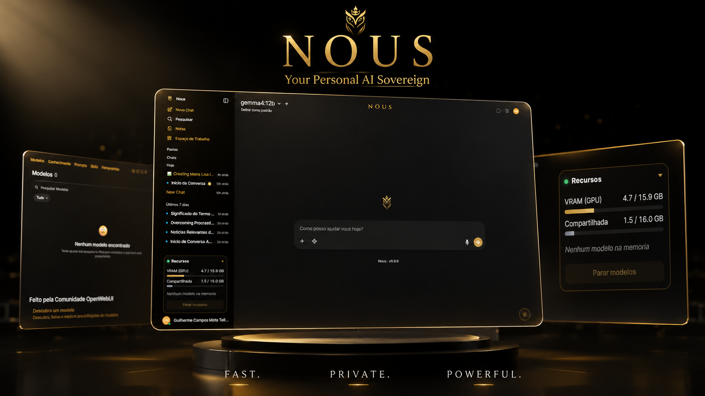
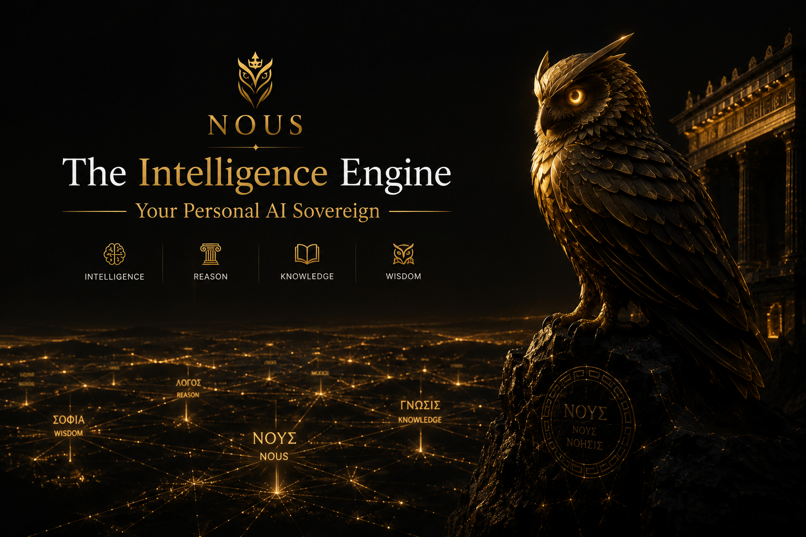
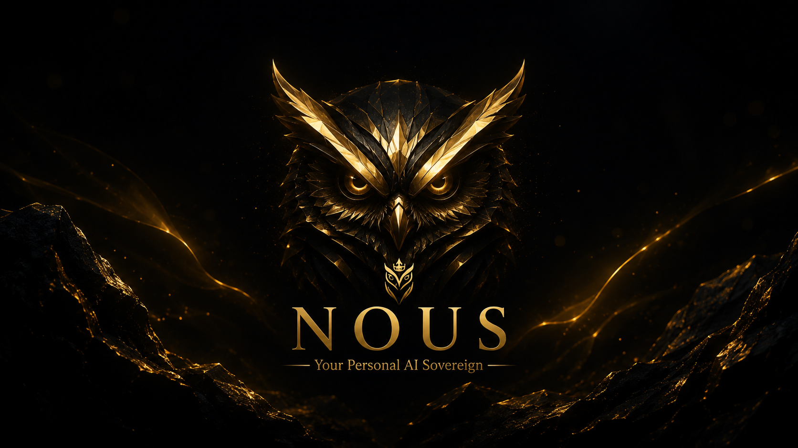

<div align="center">


# Nous

**Your own private AI — beautiful, local, and yours.**

Chat · Vision · Local image generation · Web search — 100% on your PC.  
No cloud. No API keys. Nothing ever leaves your machine.

[](CHANGELOG.md)
[](LICENSE)
[](#requirements)
[](#why-nous)

**English** · [Português](README.pt-BR.md)



</div>

---

## Why Nous

**Nous** (Greek *νοῦς*, "mind / intellect") turns a local **Ollama + Open WebUI** stack into a polished, private product — a calm **White & Gold** theme, an owl mark, and several things the raw stack does not give you:

- **Truly private** — the model and every conversation stay on your computer.
- **Remembers you** — learns durable facts about you across conversations and recalls them automatically, on-device. The one thing cloud AI can't safely do.
- **Reads your files** — point it at your Obsidian vault (or any notes folder) and Nous searches your `.md`/`.txt` files and injects relevant passages into every conversation.
- **Beautiful by default** — custom theme, logo, light/dark toggle, on-brand UI.
- **Generate images locally** — type *"create an image of…"* and it appears inline in the chat, powered by ComfyUI + Flux. No subscriptions.
- **Vision** — drop a screenshot or photo and ask about it; the model actually sees it.
- **Web search** — optional, via DuckDuckGo. No API key required.
- **Resource panel** — live GPU VRAM / shared memory, which models are loaded, and a one-click stop button to free your card.
- **Runs in the background** — no terminal windows; launch from a desktop shortcut.

---

<div align="center">

</div>

---

## Requirements

| Resource | Minimum | Recommended |
|----------|---------|-------------|
| OS       | Windows 10 / 11 | Windows 11 |
| RAM      | 8 GB | 16 GB+ |
| GPU / VRAM | none — runs on CPU (slow) | 8 GB+ VRAM for GPU acceleration |
| Disk     | 20 GB free | 30 GB+ |

> **No dedicated GPU?** Nous still works on CPU-only machines — just slower (1–2 min per reply). The installer detects this automatically and picks a lighter model for you.

---

## Quick start — double-click install

> **This is the only thing you need to do.** No terminal, no configuration.

1. Click the green **Code → Download ZIP** button at the top of this page.
2. Unzip it anywhere (e.g. `Downloads\Nous WebUI`).
3. Open the folder and **double-click `instalar.bat`**.
4. If Windows shows a warning, choose **"More info → Run anyway"** or **"Yes"**.

The installer will:
- Check your hardware and pick the right AI model for your machine
- Install Ollama, Python, and Open WebUI automatically
- Download the AI model (~5 GB — takes a few minutes)
- Create a **Nous** shortcut on your Desktop

When it finishes, **open Nous from the Desktop shortcut**.

> If the shortcut didn't appear, double-click **`iniciar.bat`** in the Nous folder instead.

---

## First run — 3 steps

**Step 1 — Create your account**

The first screen asks you to sign up. Enter any name, any email, any password — this account stays on your machine only. **The first account created is automatically the administrator.**

**Step 2 — Select your model**

The installer downloaded the model you chose. You'll see its name in the model selector at the top of the chat. Click it and start chatting.

> Want a different model? Click the model name at the top → Search → type any model name from [ollama.com/library](https://ollama.com/library) → Download.

**Step 3 — Start talking**

Type anything. Nous is ready.

---

## Which AI model should I use?

**Nous works with any model available on [ollama.com/library](https://ollama.com/library)** — there are hundreds. The installer shows your hardware specs and asks which model you want; you can type any model name from the Ollama library.

To switch models later: open the chat, click the model name at the top, search for the one you want, and click Download. You can have multiple models installed at the same time and switch between them freely.

The table below shows a few popular examples — these are just suggestions, not requirements.

### With a dedicated GPU (NVIDIA or AMD)

| Your VRAM | Example model | Size | What it's like |
|-----------|--------------|------|----------------|
| 8–10 GB | `gemma4:12b` | ~5 GB | Great for everyday chat, writing, Q&A |
| 12–16 GB | `qwen3:14b` | ~9 GB | Better reasoning, longer context |
| 20 GB+ | `qwen3:32b` | ~20 GB | Near GPT-4 quality |

> Not sure about your VRAM? The installer (`instalar.bat`) shows your hardware before asking.

### Without a dedicated GPU (CPU only)

| Your RAM | Example model | Size | What it's like |
|----------|--------------|------|----------------|
| 8–16 GB | `gemma4:e4b` | ~3 GB | Fast on CPU, good for everyday use |
| 16–32 GB | `qwen3:8b` | ~5 GB | Better quality, slightly slower |
| 32 GB+ | `gemma4:12b` | ~5 GB | Full quality, but slow (1–2 min/reply) |

> Browse the full catalogue at **[ollama.com/library](https://ollama.com/library)**. Any model listed there works with Nous.

### Cloud models (optional) — GPT-4, Claude, Gemini

Nous is **local by default**, but if you ever want more power you can *optionally* plug in a paid cloud model. Nothing changes unless you add a key — without one, Nous stays 100% local.

1. Open the chat → **Admin Panel → Settings → Connections → OpenAI → +**.
2. Paste a base URL and your API key, then **Save**. The models appear in the selector at the top.
   - **GPT-4 / GPT-4o** — URL `https://api.openai.com/v1` + your OpenAI key.
   - **Claude + Gemini + GPT, one key** — URL `https://openrouter.ai/api/v1` + your [OpenRouter](https://openrouter.ai) key. (This is the recommended way to use Claude, which isn't directly OpenAI-compatible.)

> **Your data stays yours, even with a cloud model.** Memory, files and history always run on your local Ollama — only the text of the current conversation is sent to the provider you chose. A cloud model never sees your indexed notes or your stored memories.

---

## Troubleshooting

### "Windows protected your PC" / "Unknown publisher"

This is normal for unsigned local software. Click **"More info"** → **"Run anyway"**.

### The shortcut didn't appear on the Desktop

Double-click **`iniciar.bat`** in the Nous folder. It opens Nous the same way.

### Nous opens but I don't see a model to chat with

Click the model name at the top of the chat screen → **Search** → type `gemma4:12b` → click the download icon. Wait for it to finish, then select it.

### It says "Ollama is not running" or the chat doesn't respond

Open Nous from the Desktop shortcut (don't open the website directly). The shortcut starts Ollama automatically. If it's already open, click **Stop models** in the resource panel and reopen.

### The install failed / I want to start over

Double-click **`desinstalar.bat`** → choose option **[1] Safe removal**, then double-click **`instalar.bat`** again.

### I forgot my password

```powershell
python tools\reset-password.py --email you@example.com
```

Run this from inside the Nous folder.

---

## Local image generation (optional)

```powershell
powershell -ExecutionPolicy Bypass -File images\install-comfyui.ps1
```

Installs ComfyUI + the right PyTorch for your GPU + Flux.1 Schnell models (~12 GB). Then restart Nous, select **Gerador de Imagem Local** in the model dropdown, and ask: *"create a golden owl logo"* — the image appears inline in the conversation.

---

## Memory — Nous remembers you

As you chat, Nous quietly learns durable facts about you — your name, where you live, your work, your preferences — and recalls them in later conversations. A small *"Nous remembered N detail(s) about you"* status shows when it does. Everything is stored locally in `NousData`, which is never synced anywhere.

---

## Files — Nous reads your notes

Point Nous at a folder (your Obsidian vault, a `Documents\Nous` folder, anything with `.md`/`.txt` files) and it searches your notes before every reply, injecting the most relevant passages into the conversation.

On first launch, Nous creates `Documents\Nous` automatically. Drop notes there and Nous will use them. To point it at your Obsidian vault, open the **Nous Files** filter settings in the Open WebUI admin panel and set the `FOLDER` valve.

---

## The resource panel

A small **Recursos** card (bottom-left) shows live VRAM usage, which models are loaded, and a **"Stop models"** button that frees your GPU instantly. The launcher starts it automatically.

---

## Uninstall

Double-click **`desinstalar.bat`** and pick an option:

- **[1] Safe removal** *(recommended)* — removes only the Nous app and its Python environment. Keeps your conversations, notes, Ollama, and Python.
- **[2] Remove everything** — also deletes your conversations and uninstalls Ollama/Python (only the ones Nous installed — a pre-existing Ollama/Python is never touched).

---

## Project layout

```
Nous WebUI/
├─ branding/    identity: logo, White & Gold theme, light/dark toggle, apply_branding.py
├─ files/       local file RAG: indexer, hybrid-search filter, auto-register script
├─ images/      local image gen: ComfyUI installer, Flux models, the chat Pipe
├─ memory/      personal memory filter + auto-register script
├─ monitor/     the resource panel service (GPU + loaded models)
├─ launchers/   start/stop in the background + build the no-console .exe
├─ installer/   one-command installer + the Inno Setup (.exe) script
├─ search/      optional web-search + RAG helpers (DuckDuckGo)
├─ tools/       capability check, backup, password reset, health check
└─ docs/        roadmap, screenshots
```

## Advanced usage

<details>
<summary>Developer / power-user options</summary>

### Run the capability check manually

```powershell
powershell -ExecutionPolicy Bypass -File tools\check-system.ps1
```

Prints **CAPABLE (GPU)**, **CAPABLE (CPU)** or **NOT CAPABLE** with hardware details and model recommendations.

### Install from the command line

```powershell
powershell -ExecutionPolicy Bypass -File installer\install-nous.ps1 -WithModel -Model qwen3:14b
```

Idempotent. Checks capability, installs Ollama + Python + Open WebUI only if missing, applies the Nous identity, creates the shortcut. Add `-WithImages` to also install the ComfyUI image engine, or `-Force` to reinstall.

### Manual install

```powershell
# 1) Ollama  →  https://ollama.com
# 2) Python 3.11 + Open WebUI
py -3.11 -m venv $env:USERPROFILE\open-webui
& $env:USERPROFILE\open-webui\Scripts\python.exe -m pip install open-webui
# 3) Apply the Nous identity
& $env:USERPROFILE\open-webui\Scripts\python.exe branding\apply_branding.py
# 4) Launch
powershell -ExecutionPolicy Bypass -File launchers\start-nous.ps1
```

### Tools

```powershell
tools\backup-data.ps1                              # zip your data, keep 10 newest
tools\health-check.ps1                             # post-install sanity check
python tools\reset-password.py --email you@example.com
```

### Inno Setup installer (.exe)

`installer\nous-setup.iss` builds `dist\Nous-Setup.exe` with `ISCC.exe installer\nous-setup.iss`. Small online installer, creates shortcuts and an uninstaller. Unsigned — Windows may ask "More info → Run anyway".

</details>

---

<div align="center">

</div>

---

## Built on

[Open WebUI](https://github.com/open-webui/open-webui) ·
[Ollama](https://ollama.com) ·
[ComfyUI](https://github.com/comfyanonymous/ComfyUI) ·
[Flux.1 Schnell](https://huggingface.co/black-forest-labs/FLUX.1-schnell) (Apache-2.0).  
All trademarks belong to their respective projects.

## License

[MIT](LICENSE) © Nous. Contributions welcome — open an issue or a PR.
