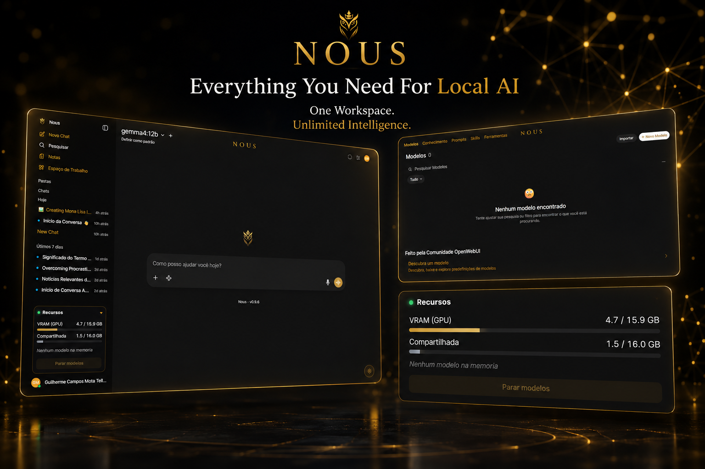
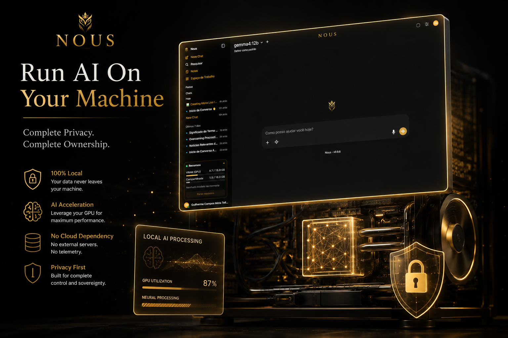

<div align="center">


# Nous

**Your own private AI — beautiful, local, and yours.**

Chat · Vision · Local image generation · Web search — 100% on your PC.  
No cloud. No API keys. Nothing ever leaves your machine.

[](CHANGELOG.md)
[](LICENSE)
[](#requirements)
[](#why-nous)

**English** · [Português](README.pt-BR.md)


</div>

---

## Why Nous

**Nous** (Greek *νοῦς*, "mind / intellect") turns a local **Ollama + Open WebUI** stack into a polished, private product with its own identity — a calm **White & Gold** theme, an owl mark, and several things the raw stack does not give you:

- **Truly private** — the model and every conversation stay on your computer.
- **Remembers you** — learns durable facts about you across conversations and recalls them automatically, on-device. The one thing cloud AI can't safely do.
- **Beautiful by default** — custom theme, logo, light/dark toggle, on-brand UI.
- **Generate images locally** — type *"create an image of…"* and it appears inline in the chat, powered by ComfyUI + Flux. No subscriptions.
- **Vision** — drop a screenshot or photo and ask about it; the model actually sees it.
- **Web search** — optional, via DuckDuckGo. No API key required.
- **Resource panel** — live GPU VRAM / shared memory, which models are loaded, and a one-click stop button to free your card.
- **Runs in the background** — no terminal windows; launch from a desktop shortcut.

> This repo ships the **identity + tooling** (theme, launchers, installers, the image pipeline, the monitor). The engine (Ollama, Python/Open WebUI, the model) is installed for you by the scripts below.

---

<div align="center">

</div>

---

## At a glance

<div align="center">



<br><br>



</div>

---

## Requirements

| Resource | Minimum | Recommended |
|----------|---------|-------------|
| OS       | Windows 10 / 11 | Windows 11 |
| RAM      | 16 GB | 32 GB |
| GPU / VRAM | none — runs on CPU | 8 GB+ (12 GB+ ideal) |
| Disk     | 20 GB free | 30 GB+ |

> Image generation is GPU-heavy. It works on **NVIDIA** (CUDA) and **AMD RDNA4 (RX 9070 / 9060)** via native ROCm; other GPUs fall back to CPU (slow).

Check your machine first:

```powershell
powershell -ExecutionPolicy Bypass -File tools\check-system.ps1
```

It prints **CAPABLE (GPU)**, **CAPABLE (CPU)** or **NOT CAPABLE** with the reason.

---

## Quick start

### Easiest — download and double-click (recommended)

1. Use the green **Code → Download ZIP** button at the top of this page (or `git clone`).
2. Unzip it anywhere.
3. Open the folder and **double-click `instalar.bat`**.

That's all. It checks your machine, installs Ollama + Python + Open WebUI, applies the Nous identity and creates a desktop shortcut — no need to touch PowerShell or change any setting. If Windows shows a prompt, choose **Yes / Run anyway**.

Open Nous from the **Nous** shortcut on your desktop — or, if it isn't there, double-click **`iniciar.bat`** in the folder.

> The PowerShell commands below are for advanced users and must be run **from inside the Nous folder** (the relative paths like `tools\check-system.ps1` only resolve there).

### Option A — Installer (`.exe`) · for end users

`installer\nous-setup.iss` builds **`Nous-Setup.exe`** (Inno Setup): a small online installer that downloads and configures everything, creates shortcuts and an uninstaller. Build it with `ISCC.exe installer\nous-setup.iss` → `dist\Nous-Setup.exe`.  
*(Unsigned — Windows may ask "More info → Run anyway".)*

### Option B — One command · for developers

```powershell
powershell -ExecutionPolicy Bypass -File installer\install-nous.ps1
```

Idempotent. It gates on machine capability, installs **Ollama + Python + Open WebUI** only if missing, applies the Nous identity, fixes the logo, creates the shortcut and runs a health check. Add **`-WithImages`** to also install the local image engine (ComfyUI + Flux), or **`-Force`** to reinstall.

### Option C — Manual

```powershell
# 1) Ollama  →  https://ollama.com  (the model is pulled later, inside the app)
# 2) Python 3.11 + Open WebUI
py -3.11 -m venv $env:USERPROFILE\open-webui
& $env:USERPROFILE\open-webui\Scripts\python.exe -m pip install open-webui
# 3) Apply the Nous identity (logo, theme, light/dark toggle)
& $env:USERPROFILE\open-webui\Scripts\python.exe branding\apply_branding.py
# 4) Launch (background, opens the browser)
powershell -ExecutionPolicy Bypass -File launchers\start-nous.ps1
```

### First run — pick a model

Open Nous, create your account (the **first account is the admin**), go to  
**Admin Panel → Settings → Models**, type `gemma4:12b` under *"Pull a model from Ollama.com"* and download it — progress shows right on screen. Then pick it at the top of the chat and start talking.

---

## Local image generation (optional)

```powershell
# Installs ComfyUI + the right PyTorch for your GPU + Flux.1 Schnell models (~12 GB)
powershell -ExecutionPolicy Bypass -File images\install-comfyui.ps1
```

Restart Nous (`launchers\start-nous.ps1`) — the image pipe registers itself automatically, no credentials needed. Start the ComfyUI engine (`images\start-comfyui.ps1`), select **Gerador de Imagem Local** in the model dropdown, and ask: *"create a golden owl logo"* — the image appears **inline in the conversation**. Flux Schnell is Apache-2.0 (commercial use OK).

---

## The resource panel

A small **Recursos** card (bottom-left) polls a tiny local service (`monitor/nous_monitor.py`, port 8990) and shows, live:

- **VRAM** and **shared memory** of your GPU (Task-Manager-style totals),
- which models are **loaded** and how much each uses, with an unload countdown,
- a **"Stop models"** button that frees the VRAM instantly.

The launcher starts it automatically; models leave VRAM **30 s** after the last message (configurable).

---

## Memory — Nous remembers you

Nous keeps a personal memory that lives **only on your machine** (`memory/nous_memory.py`, a global Open WebUI filter). As you chat, it quietly learns durable facts about you — your name, where you live, your work, your preferences — and recalls them in later conversations. A small *"Nous remembered N detail(s) about you"* status shows when it does.

It installs itself automatically on launch (no import, no admin panel) and stores everything in `nous_memory.sqlite3` inside your data folder, which is gitignored. This is the first step of what makes Nous different: *a cloud AI can be smart; only a local AI can truly be yours.*

---

## How it works

```
            ┌──────────────── Nous (themed Open WebUI) ────────────────┐
  You  ───▶ │  Chat · Vision · Web search · Resource panel             │
            └───────────────┬────────────────────────┬─────────────────┘
                  text/vision│            "create an image…"
                            ▼                         ▼
                  Ollama (gemma4:12b)        ComfyUI + Flux.1 Schnell
                     100% local                  100% local
                            └──────────► image saved as a native file
                                          → shown inline in the chat
```

---

## Tools

```powershell
tools\backup-data.ps1                 # zips your data (chats/account), keeps 10 newest
tools\check-system.ps1                # capability verdict (RAM, real VRAM, disk)
tools\health-check.ps1                # post-install sanity check
python tools\reset-password.py --email you@example.com   # forgot the password
```

## Uninstall

Double-click **`desinstalar.bat`** and pick an option:

- **[1] Safe removal** — removes only the isolated Nous app (its Python environment, the desktop shortcut and the launchers) and **keeps** your data (`NousData`), your notes in `Documents\Nous`, and shared tools (Ollama, Python).
- **[2] Remove everything** — also deletes your data and uninstalls Ollama/Python.

It reads the install manifest, so Ollama/Python are only removed **if Nous installed them in the first place** — a pre-existing Ollama/Python is never touched. (Advanced, from inside the folder: `installer\uninstall-nous.ps1 -All` or `-Force`.)

## Project layout

```
Nous WebUI/
├─ branding/    identity: logo, White & Gold theme, light/dark toggle, apply_branding.py
├─ images/      local image gen: ComfyUI installer, Flux models, the chat Pipe
├─ monitor/     the resource panel service (GPU + loaded models)
├─ launchers/   start/stop in the background + build the no-console .exe
├─ installer/   one-command installer + the Inno Setup (.exe) script
├─ search/      optional web-search + RAG helpers (DuckDuckGo)
├─ tools/       capability check, backup, password reset, health check
└─ docs/        roadmap, screenshots
```

## Roadmap

See [docs/ROADMAP.md](docs/ROADMAP.md) — a true one-click installer, a first-run wizard, and a **system-tray app** that starts/stops Nous + ComfyUI together.

---

<div align="center">

</div>

---

## Built on

[Open WebUI](https://github.com/open-webui/open-webui) ·
[Ollama](https://ollama.com) ·
[ComfyUI](https://github.com/comfyanonymous/ComfyUI) ·
[Flux.1 Schnell](https://huggingface.co/black-forest-labs/FLUX.1-schnell) (Apache-2.0).  
All trademarks belong to their respective projects.

## License

[MIT](LICENSE) © Nous. Contributions welcome — open an issue or a PR.
